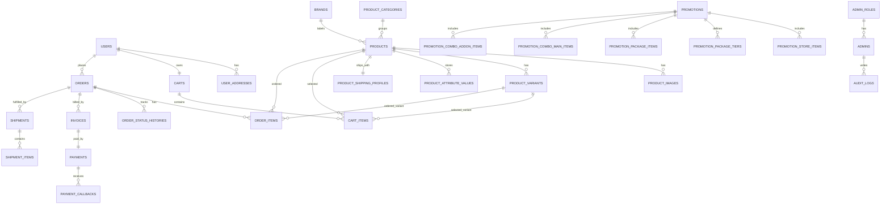
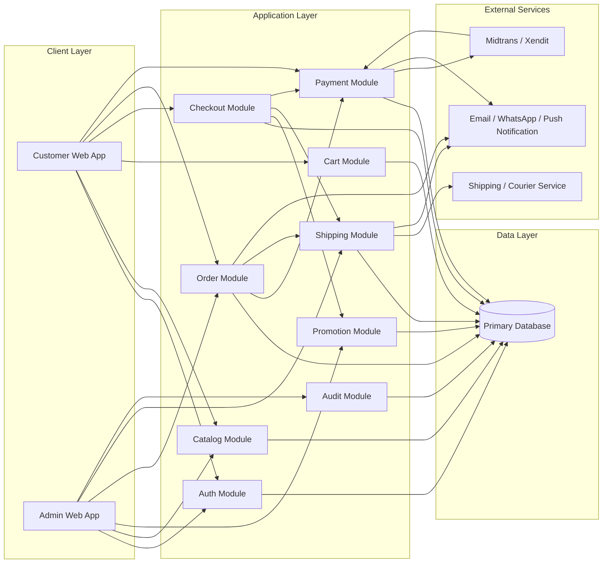
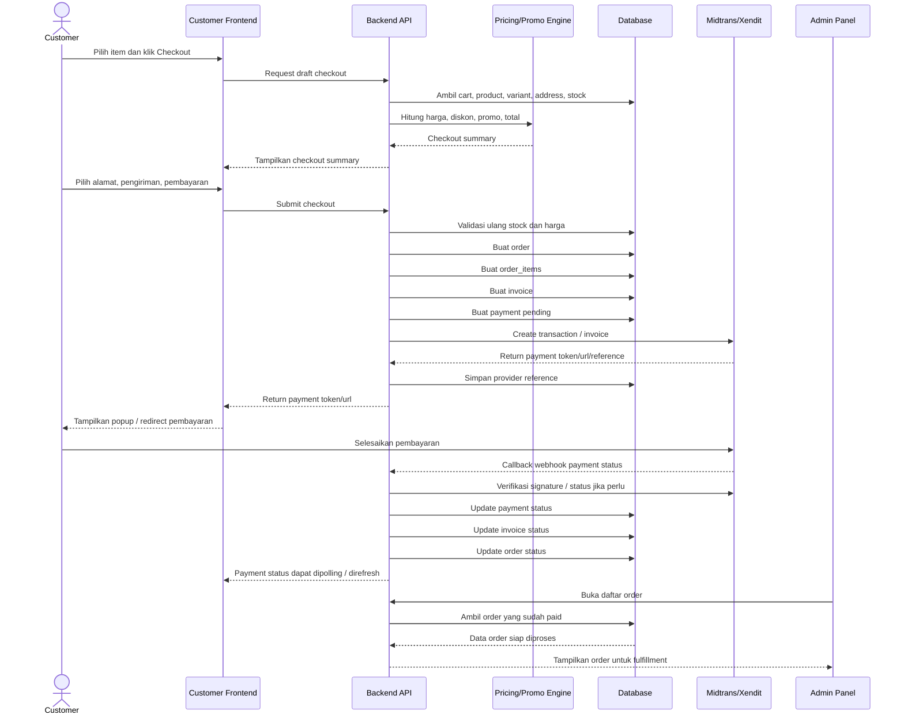

# Ayres Shop Project Documentation

## Ringkasan
Proyek ini adalah online shop dengan 2 area utama:

1. `Customer App`
2. `Admin Panel`

Sisi customer dipakai untuk browsing produk, login, checkout, pengelolaan alamat, dan pembayaran. Sisi admin dipakai untuk mengelola produk, promosi, pesanan, dan operasional toko.

Dokumen ini menyatukan `flow_admin.md` dan `flow_user.md` menjadi satu arsitektur data dan arsitektur sistem yang konsisten.

## Dokumen Referensi
- [flow_admin.md](D:\ayres_shop\flow_admin.md)
- [flow_user.md](D:\ayres_shop\flow_user.md)

---

## 1. Visi Produk

Membangun online shop milik sendiri dengan pengalaman yang familiar seperti Shopee:
- katalog produk yang mudah dibrowse
- detail produk dengan variasi dan promo
- checkout yang cepat
- alamat dan pengiriman yang jelas
- pembayaran via Midtrans atau Xendit
- panel admin yang kuat untuk produk, promosi, dan order fulfillment

---

## 2. Scope Sistem

## 2.1 Customer App
- login dan register
- katalog produk
- detail produk
- cart
- checkout
- alamat customer
- pembayaran
- pesanan saya

## 2.2 Admin Panel
- product management
- promotion center
- order management
- admin users dan audit log

---

## 3. Flow Customer

## 3.1 Tujuan Flow Customer
Flow customer dirancang agar user bisa bergerak dari tahap melihat produk sampai pembayaran dengan alur yang pendek, jelas, dan stabil.

## 3.2 Ringkasan Flow Customer
1. Customer membuka website.
2. Customer login atau register.
3. Customer melihat katalog produk.
4. Customer masuk ke detail produk.
5. Customer memilih variasi dan jumlah.
6. Customer klik `Masukkan Keranjang` atau `Beli Sekarang`.
7. Customer masuk ke cart atau checkout.
8. Customer memilih atau menambah alamat.
9. Customer memilih pengiriman.
10. Customer memilih metode pembayaran.
11. Sistem membuat order, invoice, dan payment transaction.
12. Customer membayar via Midtrans atau Xendit.
13. Sistem menerima callback pembayaran.
14. Status order berubah dan customer bisa melihatnya di `Pesanan Saya`.

## 3.3 Flow Detail Customer

### 1. Login / Register
- Customer dapat login sebelum checkout.
- Guest tetap bisa browse katalog dan detail produk.
- Jika guest menekan `Beli Sekarang` atau `Checkout`, sistem mengarahkan ke login bila session belum ada.

### 2. Browse Katalog
- Customer melihat daftar produk aktif.
- Customer dapat filter berdasarkan kategori, warna, ukuran, label, dan sorting.
- Hanya produk `Live` yang tampil.

### 3. Detail Produk
- Customer melihat foto, nama, harga, diskon, variasi, stok, dan informasi pengiriman.
- Customer wajib memilih variasi jika produk memiliki variasi.
- Customer menentukan kuantitas sesuai stok dan batas pembelian.

### 4. Cart / Buy Now
- `Masukkan Keranjang` menambahkan item ke cart untuk dibeli nanti.
- `Beli Sekarang` langsung membuat draft checkout dari item terpilih.
- Sistem selalu memvalidasi stok, variasi, dan harga aktif.

### 5. Checkout
- Customer memilih item checkout.
- Customer memilih alamat pengiriman.
- Customer memilih kurir atau layanan pengiriman.
- Sistem menghitung subtotal, diskon, ongkir, dan total akhir.

### 6. Alamat
- Customer dapat menambah, edit, hapus, dan memilih alamat default.
- Alamat aktif menentukan ongkir dan opsi layanan pengiriman.

### 7. Pembayaran
- Customer memilih metode bayar dari Midtrans atau Xendit.
- Backend membuat payment transaction.
- Frontend menampilkan popup, redirect URL, atau instruksi bayar.
- Status final pembayaran hanya ditentukan backend dari callback gateway.

### 8. Pesanan Saya
- Setelah order dibuat, customer bisa melihat status:
  - belum bayar
  - diproses
  - dikirim
  - selesai
  - dibatalkan
- Halaman ini membaca data order yang sama dengan panel admin.

## 3.4 Prinsip Penting Flow Customer
- customer tidak boleh melihat produk non-aktif
- harga final dihitung ulang saat checkout
- stok diverifikasi lagi saat order dibuat
- payment final tidak boleh hanya bergantung pada redirect frontend

---

## 4. Flow Admin

## 4.1 Tujuan Flow Admin
Flow admin dirancang agar operasional toko dapat mengelola katalog, promosi, dan pesanan secara konsisten dari satu panel.

## 4.2 Ringkasan Flow Admin
1. Admin login ke panel admin.
2. Admin mengelola produk.
3. Admin membuat atau mengubah promosi.
4. Customer melakukan order.
5. Sistem menerima pembayaran.
6. Admin melihat order masuk.
7. Admin memproses pengemasan dan pengiriman.
8. Admin memperbarui status fulfillment.
9. Customer menerima update status pesanan.

## 4.3 Flow Detail Admin

### 1. Product Management
- Admin membuat produk baru.
- Admin mengisi foto, nama, kategori, spesifikasi, deskripsi, harga, stok, variasi, dan pengiriman.
- Admin menyimpan produk sebagai `Draft`, `Archived`, atau `Live`.
- Hanya produk `Live` yang tampil di sisi customer.

### 2. Product Update
- Admin dapat edit produk kapan saja.
- Perubahan data produk mempengaruhi katalog customer untuk item yang belum menjadi order.
- Order yang sudah dibuat tetap memakai snapshot data saat transaksi.

### 3. Promotion Center
- Admin membuat `Promo Toko`, `Paket Diskon`, atau `Kombo Hemat`.
- Promo terhubung ke produk atau variasi.
- Saat promo aktif, engine pricing menghitung harga promo untuk customer.
- Saat promo berakhir, harga customer kembali ke harga dasar atau rule promo lain yang masih berlaku.

### 4. Order Management
- Setelah customer checkout dan pembayaran valid, order masuk ke panel admin.
- Admin melihat daftar order berdasarkan status.
- Admin dapat memfilter order yang perlu diproses atau perlu dikirim.

### 5. Fulfillment
- Admin menyiapkan barang.
- Admin memilih metode pengiriman seperti pickup atau drop off.
- Admin memasukkan data pengiriman / resi jika diperlukan.
- Sistem mengubah status fulfillment dan order.

### 6. Bulk Shipping
- Admin dapat memproses banyak order sekaligus pada tab `Perlu Dikirim`.
- Sistem hanya menerima order yang memenuhi syarat untuk pengiriman massal.

### 7. Audit dan Kontrol
- Semua aksi penting admin perlu dicatat ke `audit_logs`.
- Hard delete untuk produk sebaiknya dibatasi.
- Perubahan status payment tidak dilakukan manual kecuali lewat proses terkontrol.

## 4.4 Prinsip Penting Flow Admin
- admin adalah pengelola data master katalog
- admin tidak boleh mengubah hasil final payment tanpa validasi
- admin bekerja pada order yang dibuat customer, bukan membuat order manual pada MVP
- data promo dan produk harus konsisten karena langsung mempengaruhi frontend customer

---

## 5. Arsitektur Modul

Sistem dibagi menjadi beberapa domain inti:

1. `Identity`
2. `Catalog`
3. `Cart`
4. `Checkout`
5. `Order`
6. `Payment`
7. `Promotion`
8. `Shipping`
9. `Admin`
10. `Audit`

## 5.1 Identity
Menangani:
- customer account
- admin account
- login
- register
- session
- roles dan permissions

## 5.2 Catalog
Menangani:
- kategori produk
- produk
- variasi produk
- gambar produk
- atribut produk
- harga dasar
- stok

## 5.3 Cart
Menangani:
- keranjang user
- item keranjang
- snapshot harga saat item dimasukkan

## 5.4 Checkout
Menangani:
- draft checkout
- alamat aktif
- ongkir
- voucher / promo yang terpasang
- final total sebelum order dibuat

## 5.5 Order
Menangani:
- order header
- order item
- invoice
- status order
- status fulfillment

## 5.6 Payment
Menangani:
- payment transaction
- payment provider
- callback gateway
- sinkronisasi status payment

## 5.7 Promotion
Menangani:
- promo toko
- paket diskon
- kombo hemat
- rule promo per produk / variasi

## 5.8 Shipping
Menangani:
- alamat user
- kurir
- service level
- shipment
- tracking / resi

## 5.9 Admin
Menangani:
- admin action
- moderation data produk
- proses order
- pengiriman massal

## 5.10 Audit
Menangani:
- log perubahan data penting
- histori perubahan order, promo, produk, dan payment

---

## 6. Sinkronisasi Flow Admin dan Customer

## 6.1 Prinsip Sinkronisasi
`Admin` dan `Customer` tidak boleh punya model data terpisah untuk entitas inti. Keduanya harus membaca dan menulis ke domain yang sama, tetapi lewat rule dan permission yang berbeda.

Contoh:
- admin membuat dan mengubah `product`
- customer hanya membaca `product` yang berstatus `Live`
- customer membuat `order`
- admin memproses `order` yang dibuat customer
- admin membuat `promotion`
- customer melihat harga promo yang dihasilkan sistem promosi

## 6.2 Mapping Modul Admin ke Customer

### Product Admin -> Catalog Customer
- admin membuat produk
- admin mengisi spesifikasi, variasi, harga, stok, pengiriman
- jika status produk `Live`, produk tampil di katalog customer
- detail product customer membaca data dari `products`, `product_variants`, `product_images`, `product_attribute_values`

### Promotion Admin -> Pricing Customer
- admin membuat promo toko, paket diskon, atau kombo hemat
- engine pricing menghitung harga tampil dan diskon aktif di sisi customer
- customer melihat harga promo di katalog, detail produk, cart, dan checkout

### Order Customer -> Order Admin
- customer membuat order dari checkout
- payment sukses mengubah status order menjadi siap diproses
- admin melihat order di panel `Pesanan`
- admin mengatur shipment dan mengubah fulfillment status
- customer melihat update status pada `Pesanan Saya`

### Address Customer -> Shipping Admin
- customer menyimpan alamat
- checkout menggunakan alamat aktif untuk menghitung ongkir
- admin melihat snapshot alamat pengiriman pada order

### Payment Gateway -> Admin dan Customer
- customer memilih metode bayar
- backend membuat payment transaction ke Midtrans / Xendit
- callback gateway memperbarui status order
- customer melihat status pembayaran
- admin melihat status pembayaran dan status proses order

---

## 7. Arsitektur Data Bersama

## 7.1 Entitas Inti Tunggal
Berikut adalah entitas inti yang dipakai bersama oleh admin dan customer:

### Identity
- `users`
- `user_sessions`
- `admins`
- `admin_roles`

### Catalog
- `product_categories`
- `brands`
- `products`
- `product_images`
- `product_attributes`
- `product_attribute_values`
- `product_variants`
- `product_variant_images`
- `product_shipping_profiles`

### Customer Experience
- `user_addresses`
- `carts`
- `cart_items`
- `wishlists`
- `product_reviews`

### Promotion
- `promotions`
- `promotion_store_items`
- `promotion_package_tiers`
- `promotion_package_items`
- `promotion_combo_main_items`
- `promotion_combo_addon_items`

### Order and Payment
- `orders`
- `order_items`
- `order_status_histories`
- `invoices`
- `payments`
- `payment_callbacks`
- `shipments`
- `shipment_items`

### Reference and Audit
- `couriers`
- `payment_methods`
- `audit_logs`

## 7.2 Sumber Kebenaran per Domain

### Product
Source of truth:
- `products`
- `product_variants`
- `product_images`

### Promo
Source of truth:
- `promotions`
- tabel item promosi turunan

### Harga tampil customer
Source of truth:
- harga dasar dari `products` / `product_variants`
- rule promo aktif dari `promotions`

### Cart
Source of truth:
- `carts`
- `cart_items`

### Order
Source of truth:
- `orders`
- `order_items`
- `order_status_histories`

### Payment
Source of truth:
- `payments`
- `payment_callbacks`
- notifikasi resmi provider

### Shipment
Source of truth:
- `shipments`
- `shipment_items`

---

## 8. Relasi Data Tingkat Tinggi

---

## 9. Lifecycle Status yang Harus Konsisten

## 9.1 Product Status
- `Draft`
- `Live`
- `Under Review`
- `Archived`
- `Rejected`

Rule:
- customer hanya bisa melihat produk `Live`
- `Archived` tidak tampil di customer
- promo hanya bisa aktif pada produk / variasi yang valid

## 9.2 Promotion Status
- `Draft`
- `Scheduled`
- `Active`
- `Paused`
- `Ended`
- `Cancelled`

Rule:
- hanya promo `Active` yang mempengaruhi harga customer
- promo `Scheduled` bisa dipreview admin tetapi belum aktif di frontend customer

## 9.3 Order Status
- `Unpaid`
- `Pending Payment`
- `Paid`
- `Processed`
- `Ready to Ship`
- `Shipped`
- `Completed`
- `Cancelled`
- `Refunded`

## 9.4 Fulfillment Status
- `Pending`
- `Packed`
- `Waiting Pickup`
- `In Delivery`
- `Delivered`
- `Returned`

## 9.5 Payment Status
- `Pending`
- `Paid`
- `Failed`
- `Expired`
- `Cancelled`
- `Refunded`

Rule:
- order status final tidak boleh ditentukan frontend
- payment status final hanya ditentukan backend setelah verifikasi gateway

---

## 10. Arsitektur Harga dan Promo

Harga yang dilihat customer tidak langsung diambil dari satu field final, tetapi dihitung dari beberapa komponen:

1. harga dasar produk / variasi
2. promo toko aktif
3. paket diskon aktif
4. kombo hemat aktif
5. voucher saat checkout

## 10.1 Prinsip Harga
- `base_price` berasal dari `products` atau `product_variants`
- `display_price` dihitung untuk katalog dan detail produk
- `checkout_price` dihitung ulang saat checkout
- `paid_price` disimpan di `order_items` sebagai snapshot final transaksi

## 10.2 Snapshot Penting
Simpan snapshot agar histori tidak berubah saat admin mengubah data setelah order dibuat:
- nama produk saat order
- nama variasi saat order
- harga saat order
- diskon saat order
- alamat pengiriman saat order
- ongkir saat order

---

## 11. Arsitektur Checkout dan Payment

## 11.1 Flow Teknis Singkat
1. Customer pilih item dari cart atau buy now.
2. Backend buat draft checkout.
3. Customer pilih alamat dan kurir.
4. Backend hitung ongkir dan total akhir.
5. Customer klik `Buat Pesanan`.
6. Backend buat:
   - `orders`
   - `order_items`
   - `invoices`
   - `payments`
7. Backend call Midtrans atau Xendit.
8. Gateway kirim callback.
9. Backend verifikasi callback.
10. Backend update payment status dan order status.
11. Admin memproses order.

## 11.2 Integrasi Payment

### Midtrans
- gunakan Snap atau Core API
- backend menyimpan `provider_reference`
- callback wajib diverifikasi server-side

### Xendit
- gunakan invoice atau payment request
- backend menyimpan `provider_reference`
- webhook wajib diverifikasi signature

## 11.3 Rule Payment
- satu order boleh punya lebih dari satu invoice historis, tapi hanya satu invoice aktif
- satu invoice punya satu payment utama
- payment retry harus tetap terhubung ke order yang sama

---

## 12. Boundary Frontend dan Backend

## 12.1 Frontend Customer
Tanggung jawab:
- render katalog
- render detail produk
- cart dan checkout UI
- halaman alamat
- halaman payment status

Tidak boleh menjadi sumber kebenaran untuk:
- harga final
- payment final status
- stok final
- order final status

## 12.2 Frontend Admin
Tanggung jawab:
- CRUD produk
- kelola promo
- proses pesanan
- proses pengiriman

## 12.3 Backend API
Tanggung jawab:
- autentikasi
- business rules
- pricing calculation
- order creation
- payment integration
- callback verification
- shipment orchestration
- audit logging

---

## 13. Struktur Route Tingkat Tinggi

## 13.1 Customer Frontend
- `/`
- `/collections`
- `/collections/:slug`
- `/products/:slug`
- `/login`
- `/register`
- `/cart`
- `/checkout`
- `/orders`
- `/orders/:id`
- `/addresses`
- `/profile`
- `/payment/:invoiceNumber`

## 13.2 Admin Frontend
- `/admin`
- `/admin/orders`
- `/admin/orders/:id`
- `/admin/products`
- `/admin/products/create`
- `/admin/products/:id`
- `/admin/products/:id/edit`
- `/admin/promotions`
- `/admin/promotions/store/create`
- `/admin/promotions/package/create`
- `/admin/promotions/combo/create`
- `/admin/settings/users`
- `/admin/settings/roles`

## 13.3 Backend API
- `/api/auth/*`
- `/api/products/*`
- `/api/cart/*`
- `/api/addresses/*`
- `/api/checkout`
- `/api/orders/*`
- `/api/payments/*`
- `/api/admin/*`

---

## 14. MVP Prioritas Implementasi

## Tahap 1
- katalog customer
- detail produk
- login/register customer
- product management admin

## Tahap 2
- cart
- address management
- checkout
- order management admin

## Tahap 3
- payment Midtrans / Xendit
- status pesanan customer
- shipment admin

## Tahap 4
- promotion center admin
- promo tampil di customer
- voucher dan pricing engine lebih lengkap

---

## 15. Risiko Arsitektur yang Harus Dijaga

### Harga tidak sinkron
Solusi:
- hitung ulang harga saat checkout
- simpan snapshot harga pada order item

### Payment callback tidak sinkron
Solusi:
- backend wajib verifikasi callback
- jangan percaya redirect frontend

### Stok oversell
Solusi:
- validasi stok saat add to cart, checkout, dan create order
- lakukan stock reservation bila diperlukan pada tahap lanjut

### Promo bentrok
Solusi:
- definisikan priority rule promo
- batasi stacking promo pada MVP

### Data order berubah setelah admin edit produk
Solusi:
- simpan snapshot order item dan alamat pengiriman

---

## 16. Rekomendasi Aturan MVP

Untuk versi awal, gunakan aturan sederhana:

1. satu toko, bukan multi-vendor
2. satu mata uang
3. maksimal 2 level variasi produk
4. satu alamat pengiriman aktif per checkout
5. satu invoice aktif per order
6. promo aktif tidak ditumpuk bebas
7. admin memakai `archive`, bukan hard delete, untuk produk

---

## 17. Definisi Selesai Dokumentasi Tahap Ini

Tahap dokumentasi saat ini dianggap selesai bila:
- flow admin sudah terdokumentasi
- flow customer sudah terdokumentasi
- use case admin dan customer sudah ada
- workflow diagram sudah ada
- ERD awal admin dan customer sudah ada
- route admin dan customer sudah ada
- arsitektur data bersama sudah didefinisikan

---

## 18. Next Step

Dokumentasi berikutnya yang disarankan:

1. `db_schema.md`
   detail tabel, kolom, tipe data, enum, foreign key, index
2. `api_spec.md`
   request/response endpoint customer dan admin
3. `wireframe_customer.md`
   struktur halaman customer
4. `wireframe_admin.md`
   struktur halaman admin
5. `pricing_rules.md`
   aturan promo dan prioritas diskon
6. `payment_integration.md`
   flow teknis Midtrans dan Xendit secara detail

---

## 19. System Architecture Diagram

## 19.1 Tujuan
Diagram ini menjelaskan komponen utama sistem dan hubungan antar layer agar implementasi admin, customer, backend, database, payment, dan shipping tetap sinkron.

## 19.2 Komponen Utama
- `Customer Web App`
- `Admin Web App`
- `Backend API`
- `Database`
- `Payment Gateway`
- `Shipping Service`
- `Notification Service` opsional

## 19.3 Diagram Arsitektur Sistem

## 19.4 Penjelasan Arsitektur

### Customer Web App
Frontend untuk:
- login customer
- lihat katalog
- detail produk
- cart
- checkout
- pembayaran
- pesanan saya

### Admin Web App
Frontend untuk:
- CRUD produk
- kelola promo
- lihat dan proses pesanan
- atur pengiriman
- audit aktivitas

### Backend API
Pusat business logic untuk:
- autentikasi
- validasi data
- pricing calculation
- pembuatan order
- integrasi payment gateway
- callback verification
- sinkronisasi shipment

### Database
Menyimpan seluruh source of truth utama:
- catalog
- promo
- cart
- order
- payment
- shipment
- audit log

### Midtrans / Xendit
Dipakai untuk:
- create payment transaction
- menampilkan payment instruction
- mengirim callback pembayaran

### Shipping Service
Dipakai untuk:
- cek layanan kirim
- ongkir
- pickup / drop off
- tracking / resi

---

## 20. Sequence Diagram Checkout + Payment

## 20.1 Tujuan
Diagram ini menjelaskan urutan teknis dari saat customer checkout sampai payment dikonfirmasi dan order siap diproses admin.

## 20.2 Sequence Diagram

## 20.3 Penjelasan Sequence Checkout

### Step 1: Draft Checkout
- frontend meminta ringkasan checkout
- backend mengambil item, stok, alamat, dan promo aktif
- backend menghitung total yang benar sebelum user submit order

### Step 2: Submit Checkout
- backend melakukan validasi ulang
- backend tidak boleh memakai data total dari frontend sebagai sumber kebenaran
- backend membuat `order`, `order_items`, `invoice`, dan `payment`

### Step 3: Create Payment
- backend menghubungi Midtrans atau Xendit
- provider mengembalikan token atau URL pembayaran
- frontend hanya menampilkan atau redirect ke channel pembayaran

### Step 4: Payment Confirmation
- payment sukses dikonfirmasi lewat callback resmi gateway
- backend update status invoice dan order
- order yang sudah paid menjadi terlihat di panel admin

## 20.4 Rule Penting Sequence Payment
- callback gateway selalu lebih dipercaya daripada redirect frontend
- order tidak masuk proses fulfillment sebelum payment valid
- semua perubahan payment harus tercatat
- retry payment harus tetap terhubung ke order yang sama
