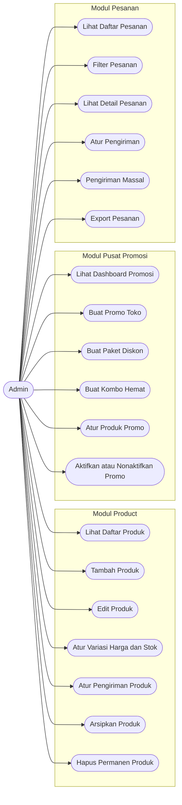
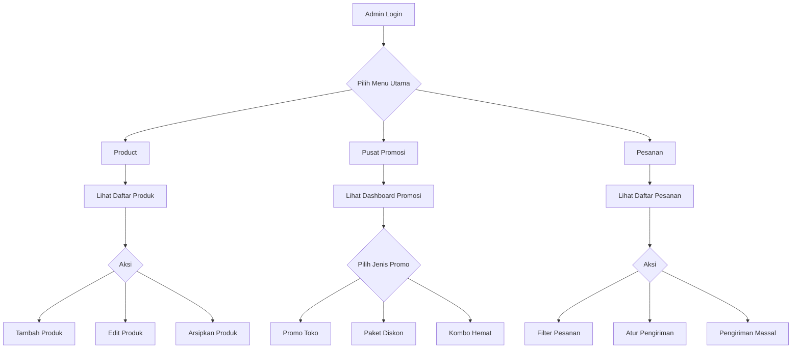
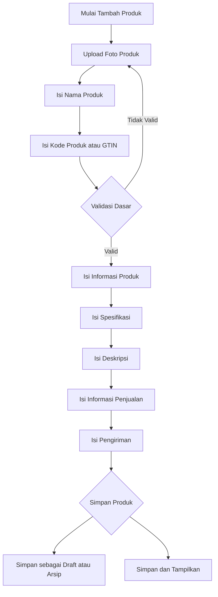
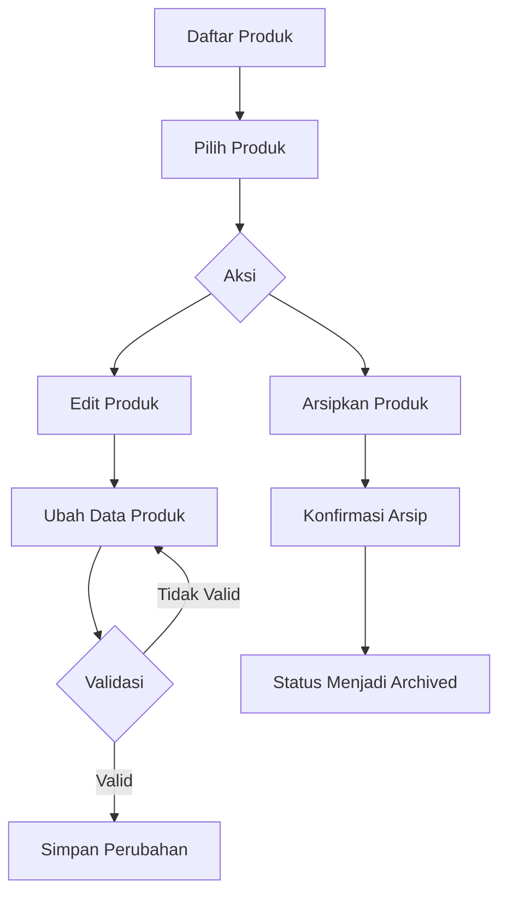
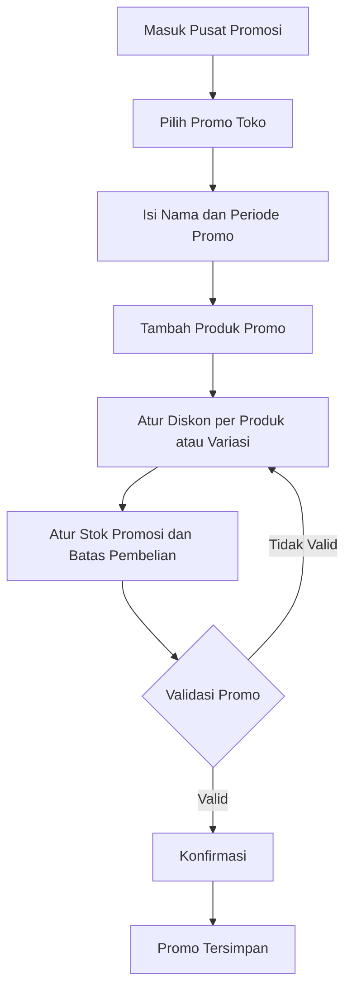
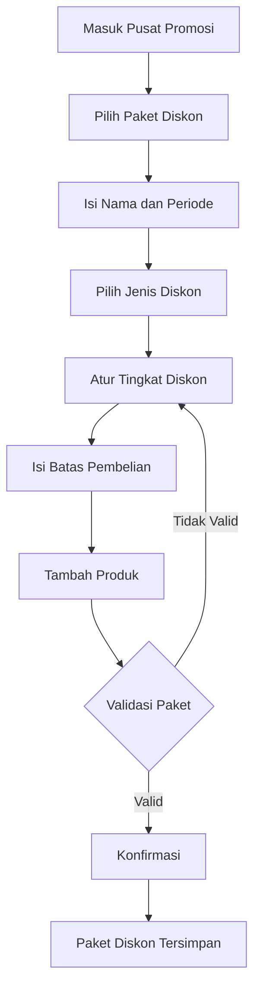
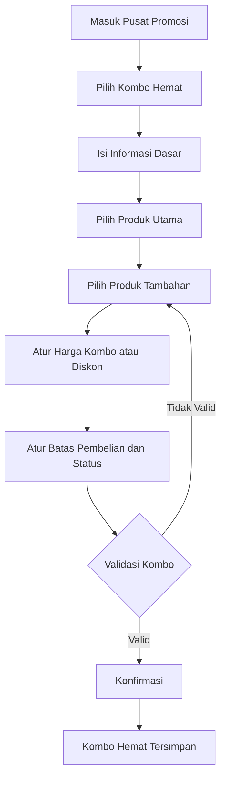
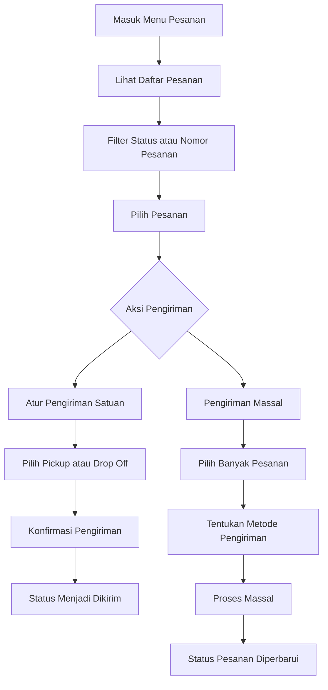

# Flow Admin Online Shop

## Tujuan
Dokumen ini menjelaskan flow awal untuk panel admin online shop dengan referensi alur seperti Shopee. Fokus tahap ini hanya sisi admin dengan 3 menu utama:

1. `Pesanan`
2. `Product`
3. `Pusat Promosi`

Dokumen ini dipakai sebagai acuan untuk:
- perancangan menu admin
- perancangan halaman dan form
- perancangan status dan validasi
- pembagian scope frontend, backend, dan database

## Struktur Menu Admin

### 1. Pesanan
- Daftar pesanan
- Filter status pesanan
- Detail pesanan
- Atur pengiriman
- Pengiriman massal

### 2. Product
- Daftar produk
- Tambah produk
- Ubah produk
- Hapus / arsipkan produk
- Variasi produk
- Pengaturan harga, stok, dan pengiriman

### 3. Pusat Promosi
- Dashboard promosi
- Promo Toko
- Paket Diskon
- Kombo Hemat

---

## A. FLOW PRODUCT

## A.1 Tujuan Modul Product
Modul `Product` dipakai admin untuk mengelola seluruh katalog produk, mulai dari membuat produk baru, mengedit data produk, mengatur variasi, harga, stok, pengiriman, sampai mengarsipkan produk.

## A.2 Submenu Product
- `Daftar Produk`
- `Tambah Produk`
- `Edit Produk`
- `Arsipkan / Hapus Produk`

## A.3 Flow Umum Daftar Produk

### Tujuan
Menampilkan semua produk aktif dan memberi aksi cepat ke setiap produk.

### Komponen utama
- Tab status produk:
  - `Semua`
  - `Live`
  - `Perlu Tindakan`
  - `Sedang Ditinjau`
  - `Belum Ditampilkan`
- Ringkasan jumlah produk
- Filter dan sorting:
  - harga
  - stok
  - terlaris
- Grid / list produk
- Aksi per produk:
  - edit
  - salin
  - tampilan produk
  - arsipkan
  - naikkan produk
  - atur komisi affiliate

### Flow
1. Admin membuka menu `Product`.
2. Sistem menampilkan daftar produk sesuai tab default, misalnya `Live`.
3. Admin dapat filter atau urutkan produk.
4. Admin memilih salah satu produk.
5. Sistem menampilkan aksi cepat pada produk tersebut.
6. Admin bisa lanjut ke:
   - edit produk
   - duplikasi produk
   - arsipkan produk
   - lihat tampilan produk

## A.4 Flow Tambah Produk Baru

### Tujuan
Admin membuat produk baru dari awal.

### Step 1: Informasi Dasar Produk
Mengacu pada layar tambah produk awal.

#### Field utama
- Foto produk
- Nama produk
- Kode produk / GTIN

#### Aturan
- Produk minimal memiliki foto utama.
- Sistem mendukung multi foto.
- Nama produk wajib diisi.
- Kode produk bisa opsional, tetapi bila kategori memerlukan GTIN maka admin harus isi atau centang produk tanpa GTIN.

#### Flow
1. Admin klik `Tambah Produk`.
2. Sistem membuka form tambah produk baru.
3. Admin upload foto produk.
4. Admin isi nama produk.
5. Admin isi kode produk / GTIN bila ada.
6. Admin klik `Selanjutnya`.
7. Sistem validasi field wajib.
8. Jika lolos, sistem masuk ke halaman detail produk.

## A.5 Flow Lengkapi Detail Produk

Setelah produk dibuat, admin melengkapi data lewat beberapa tab:

1. `Informasi Produk`
2. `Spesifikasi`
3. `Deskripsi`
4. `Informasi Penjualan`
5. `Pengiriman`
6. `Lainnya`

### A.5.1 Tab Informasi Produk
Bagian ini memuat informasi inti produk yang sudah dibuat dari langkah awal.

#### Isi minimal
- nama produk
- kategori
- foto produk
- identitas dasar produk

#### Catatan
- Kategori penting karena menentukan atribut spesifikasi dan validasi selanjutnya.

### A.5.2 Tab Spesifikasi
Admin melengkapi atribut produk sesuai kategori.

#### Contoh field dari referensi
- Merek
- Panjang kaos kaki
- Jenis kaos kaki
- Tipe paket
- Negara asal
- Bahan
- Produk custom
- No. sertifikasi halal
- Sertifikat halal
- dan atribut tambahan lain

#### Aturan
- Beberapa atribut wajib.
- Atribut mengikuti kategori produk.
- Sistem harus bisa `tampilkan lebih banyak` untuk atribut tambahan.

#### Flow
1. Admin membuka tab `Spesifikasi`.
2. Sistem memuat atribut berdasarkan kategori.
3. Admin memilih atau mengisi nilai atribut.
4. Sistem menandai atribut yang wajib.
5. Admin lanjut ke tab berikutnya setelah spesifikasi cukup lengkap.

### A.5.3 Tab Deskripsi
Admin menulis deskripsi produk.

#### Komponen
- Text editor / textarea deskripsi
- Rekomendasi isi cepat, misalnya:
  - instruksi penggunaan
  - bahan
  - ukuran
  - jumlah isi
  - warna
- Tombol bantuan AI deskripsi di masa depan bila ingin disediakan

#### Aturan
- Deskripsi wajib minimal karakter tertentu atau minimal 1 foto deskripsi.
- Maksimum karakter harus dibatasi.

#### Flow
1. Admin buka tab `Deskripsi`.
2. Admin menulis penjelasan produk.
3. Sistem menghitung jumlah karakter.
4. Jika deskripsi belum memenuhi minimum, sistem tampilkan warning.

### A.5.4 Tab Informasi Penjualan
Admin menentukan variasi, harga, stok, dan panduan ukuran.

#### Kemampuan utama
- Produk tanpa variasi
- Produk dengan variasi tunggal
- Produk dengan variasi ganda

#### Field inti
- Variasi
- Harga
- Stok
- Kode variasi
- GTIN variasi
- Upload foto per variasi
- Panduan ukuran

#### Flow tanpa variasi
1. Admin tidak mengaktifkan variasi.
2. Admin mengisi harga utama.
3. Admin mengisi stok utama.
4. Sistem menyimpan harga dan stok di level produk.

#### Flow dengan variasi
1. Admin klik `Aktifkan Variasi`.
2. Sistem menampilkan form variasi.
3. Admin mengisi nama variasi, misalnya `Warna`.
4. Admin mengisi opsi variasi, misalnya `Merah`, `Oranye`, `Hijau`.
5. Admin dapat tambah variasi kedua bila diperlukan.
6. Sistem membentuk kombinasi variasi otomatis.
7. Admin mengisi untuk tiap kombinasi:
   - harga
   - stok
   - kode variasi
   - GTIN atau status tanpa GTIN
   - foto variasi
8. Sistem validasi semua kombinasi wajib memiliki harga dan stok valid.

#### Validasi penting
- Harga harus lebih besar dari 0.
- Stok tidak boleh negatif.
- Nama variasi dan opsi tidak boleh duplikat.
- Jika GTIN kosong dan diwajibkan, admin harus menandai `produk tanpa GTIN`.

### A.5.5 Tab Pengiriman
Admin menentukan aturan pembelian dan pengiriman.

#### Field utama
- Min. jumlah pembelian
- Maks. jumlah pembelian
- Grosir
- Berat produk
- Ukuran paket:
  - panjang
  - lebar
  - tinggi
- Opsi berat dan dimensi berbeda per variasi

#### Flow
1. Admin mengisi jumlah pembelian minimum.
2. Admin mengisi batas maksimal pembelian bila ada.
3. Admin mengisi berat.
4. Admin mengisi dimensi paket.
5. Jika produk punya variasi dengan berat berbeda, admin bisa aktifkan pengaturan per variasi.

#### Validasi
- Berat wajib diisi.
- Nilai berat dan dimensi harus angka positif.

### A.5.6 Tab Lainnya
Bagian ini disiapkan untuk data tambahan non inti, misalnya:
- SEO
- catatan internal admin
- video produk
- lampiran tambahan

## A.6 Flow Simpan Produk

### Opsi aksi
- `Simpan & Arsipkan`
- `Simpan & Tampilkan`

### Flow
1. Admin selesai mengisi seluruh tab.
2. Admin klik salah satu tombol simpan.
3. Sistem validasi seluruh field wajib.
4. Jika ada error, sistem tampilkan pesan error pada section yang bermasalah.
5. Jika berhasil:
   - produk masuk ke status draft / arsip / live sesuai aksi
   - sistem menampilkan notifikasi sukses
   - sistem kembali ke daftar produk atau detail produk

## A.7 Flow Edit Produk
Flow edit mengikuti struktur tambah produk, tetapi form sudah berisi data lama.

### Flow
1. Admin buka daftar produk.
2. Admin pilih aksi `Edit`.
3. Sistem membuka halaman edit produk.
4. Admin mengubah data yang diperlukan:
   - foto
   - nama
   - spesifikasi
   - deskripsi
   - variasi
   - harga
   - stok
   - pengiriman
5. Admin simpan perubahan.
6. Sistem validasi dan menyimpan riwayat update.

## A.8 Flow Hapus / Arsipkan Produk
Untuk tahap awal lebih aman memakai `Arsipkan` daripada hard delete.

### Rekomendasi
- `Arsipkan` untuk menyembunyikan produk dari etalase
- `Hapus permanen` hanya untuk super admin atau background cleanup

### Flow Arsipkan
1. Admin pilih produk dari daftar.
2. Admin klik menu `Arsipkan`.
3. Sistem tampilkan konfirmasi.
4. Admin konfirmasi.
5. Sistem ubah status produk menjadi `Archived`.
6. Produk tidak tampil di etalase publik.

### Flow Hapus Permanen
1. Admin buka detail produk archived.
2. Admin klik `Hapus Permanen`.
3. Sistem minta konfirmasi berlapis.
4. Sistem hanya menghapus bila tidak terikat transaksi aktif.

---

## B. FLOW PUSAT PROMOSI

## B.1 Tujuan Modul Promosi
Modul `Pusat Promosi` dipakai admin untuk membuat program promo yang meningkatkan penjualan.

## B.2 Jenis Promosi
Ada 3 jenis promosi utama:

1. `Promo Toko`
2. `Paket Diskon`
3. `Kombo Hemat`

## B.3 Dashboard Pusat Promosi

### Komponen
- Tombol buat promo per jenis
- Tab daftar promosi
- Ringkasan performa promosi:
  - penjualan
  - pesanan
  - jumlah terjual
  - pembeli
- List promosi aktif dan berakhir

### Flow
1. Admin membuka menu `Pusat Promosi`.
2. Sistem menampilkan dashboard promosi.
3. Admin memilih jenis promo yang ingin dibuat.

## B.4 Flow Promo Toko

### Tujuan
Memberi diskon pada produk tertentu dalam periode tertentu.

### Step 1: Informasi Dasar

#### Field
- Nama promo toko
- Periode promo:
  - tanggal mulai
  - tanggal selesai

#### Aturan
- Nama promo hanya untuk admin internal.
- Durasi promo dibatasi, misalnya maksimal 180 hari.

### Step 2: Tambah Produk ke Promo

#### Flow
1. Admin klik `Tambah Produk`.
2. Sistem membuka modal pilih produk.
3. Admin bisa filter berdasarkan:
   - kategori
   - nama produk
   - stok tersedia
4. Admin pilih satu atau banyak produk.
5. Admin klik `Konfirmasi`.

### Step 3: Atur Diskon Produk

#### Field per produk / variasi
- Harga awal
- Harga diskon
- Persentase diskon
- Stok
- Stok promosi
- Batas pembelian
- Status aktif / nonaktif

#### Flow
1. Sistem menampilkan tabel produk yang dipilih.
2. Admin mengatur diskon per produk atau variasi.
3. Admin dapat memakai `Perubahan massal` untuk update sekaligus.
4. Admin menentukan stok promosi.
5. Admin menentukan batas pembelian bila perlu.
6. Admin mengaktifkan atau menonaktifkan item tertentu.

#### Validasi
- Harga diskon harus lebih kecil dari harga awal.
- Stok promosi harus lebih besar dari 0 dan tidak melebihi stok aktual.
- Batas pembelian tidak boleh kurang dari 1 bila diaktifkan.

### Step 4: Simpan Promo Toko
1. Admin klik `Konfirmasi`.
2. Sistem validasi informasi dasar dan item promo.
3. Jika valid, promo masuk status:
   - terjadwal
   - aktif
   - selesai

## B.5 Flow Paket Diskon

### Tujuan
Memberi promo diskon bertingkat atau paket pembelian dengan aturan khusus.

### Informasi dasar
- Nama paket diskon
- Periode paket diskon
- Jenis diskon:
  - persentase diskon
  - nominal diskon
  - harga paket diskon
- Tingkatan diskon
- Batas pembelian

### Flow
1. Admin buka `Paket Diskon`.
2. Admin isi nama promo dan periode.
3. Admin memilih jenis paket diskon.
4. Admin mengatur tingkat diskon.
5. Admin dapat menambah beberapa tingkatan.
6. Admin isi batas pembelian paket.
7. Admin klik `Tambah Produk`.
8. Admin memilih produk yang akan ikut paket diskon.
9. Sistem menampilkan tabel produk paket.
10. Admin dapat melakukan:
    - nonaktifkan massal
    - aktifkan massal
    - hapus massal
11. Admin klik `Konfirmasi`.

### Validasi
- Tiap tingkat diskon harus punya syarat yang jelas.
- Produk dalam paket harus memenuhi aturan pengiriman yang konsisten bila diperlukan.
- Periode akhir harus lebih besar dari periode mulai.

## B.6 Flow Kombo Hemat

### Tujuan
Memberi diskon pada produk tambahan bila pembeli membeli produk utama.

### Struktur kombo hemat
1. Informasi dasar
2. Produk utama
3. Produk tambahan

### Step 1: Informasi Dasar

#### Field
- Tipe promosi
- Nama promo kombo hemat
- Periode promo
- Batas pembelian produk tambahan

#### Flow
1. Admin pilih jenis `Diskon Kombo Hemat`.
2. Admin isi nama promo.
3. Admin isi periode promo.
4. Admin isi batas pembelian produk tambahan.
5. Admin klik `Simpan`.

### Step 2: Pilih Produk Utama

#### Flow
1. Admin masuk section `Produk Utama`.
2. Admin cari dan pilih satu atau lebih produk utama.
3. Sistem menampilkan daftar produk utama aktif.
4. Admin dapat ubah produk utama jika diperlukan.

### Step 3: Pilih Produk Tambahan

#### Flow
1. Admin buka section `Produk Tambahan`.
2. Admin klik `Tambah Produk Tambahan`.
3. Sistem memuat daftar produk / variasi yang bisa dijadikan produk tambahan.
4. Admin menentukan harga kombo atau diskon kombo per variasi.
5. Admin menentukan batas pembelian.
6. Admin mengatur status aktif / nonaktif per item.

#### Field utama per item tambahan
- Variasi
- Harga saat ini
- Harga kombo hemat
- Diskon kombo hemat
- Stok
- Jasa kirim
- Batas pembelian
- Status

#### Validasi
- Harga kombo harus valid dan tidak lebih tinggi dari harga normal jika itu promo diskon.
- Produk tambahan harus tetap punya stok.
- Jika ada aturan jasa kirim, produk harus kompatibel.

### Step 4: Konfirmasi Kombo Hemat
1. Admin klik `Konfirmasi`.
2. Sistem validasi:
   - informasi dasar
   - minimal 1 produk utama
   - minimal 1 produk tambahan aktif
3. Jika valid, promo disimpan.

---

## C. FLOW PESANAN

## C.1 Tujuan Modul Pesanan
Modul `Pesanan` dipakai admin untuk memantau order masuk, memproses pesanan, dan mengatur pengiriman.

## C.2 Submenu Pesanan
- Semua
- Belum Bayar
- Perlu Dikirim
- Dikirim
- Selesai
- Pengembalian / Pembatalan

## C.3 Flow Daftar Pesanan

### Komponen utama
- Tab status pesanan
- Filter tipe pesanan:
  - semua
  - pesanan reguler
  - instant
- Filter status internal:
  - semua
  - perlu diproses
  - telah diproses
  - tertunda
- Search nomor pesanan
- Filter jasa kirim
- Tombol `Terapkan` dan `Reset`
- Tombol `Export`
- Tombol `Riwayat Download`
- Tombol `Pengiriman Massal`

### Flow
1. Admin membuka menu `Pesanan`.
2. Sistem menampilkan daftar pesanan sesuai tab yang dipilih.
3. Admin dapat memfilter pesanan.
4. Sistem memuat hasil sesuai filter.
5. Admin memilih salah satu pesanan untuk diproses.

## C.4 Flow Pesanan Perlu Dikirim

### Informasi yang ditampilkan di list
- Nama pembeli
- Produk dan variasi
- Jumlah pembelian
- Nilai pembayaran
- Metode pembayaran
- Status pesanan
- Batas waktu pengiriman
- Jasa kirim
- Aksi `Atur Pengiriman`

### Flow
1. Pesanan masuk ke status `Perlu Dikirim` setelah pembayaran valid.
2. Sistem tampilkan deadline kirim.
3. Admin klik `Atur Pengiriman`.
4. Sistem membuka halaman / modal pengiriman.
5. Admin memilih metode:
   - drop off
   - pickup
6. Admin konfirmasi proses kirim.
7. Status pesanan berubah menjadi `Dikirim` setelah resi / pickup dibuat.

## C.5 Flow Pengiriman Massal

### Tujuan
Memproses banyak pesanan sekaligus.

### Flow
1. Admin buka tab `Perlu Dikirim`.
2. Admin klik `Pengiriman Massal`.
3. Admin memilih banyak pesanan yang memenuhi syarat.
4. Sistem menampilkan form aksi massal.
5. Admin menentukan metode pengiriman.
6. Sistem memproses seluruh pesanan terpilih.
7. Sistem menampilkan hasil sukses dan gagal per pesanan.

## C.6 Flow Detail Pesanan
Halaman detail pesanan nantinya minimal memuat:
- informasi pembeli
- alamat pengiriman
- item pesanan
- riwayat status
- pembayaran
- pengiriman
- catatan internal admin

---

## D. STATUS UTAMA YANG PERLU DISIAPKAN

## D.1 Status Produk
- `Draft`
- `Live`
- `Under Review`
- `Archived`
- `Rejected`

## D.2 Status Promo
- `Draft`
- `Scheduled`
- `Active`
- `Paused`
- `Ended`
- `Cancelled`

## D.3 Status Pesanan
- `Belum Bayar`
- `Perlu Diproses`
- `Perlu Dikirim`
- `Dikirim`
- `Selesai`
- `Dibatalkan`
- `Retur / Refund`

---

## E. DATA MASTER YANG PERLU ADA

### Untuk Product
- kategori produk
- atribut kategori
- brand / merek
- daftar bahan
- daftar warna
- satuan berat dan dimensi

### Untuk Promosi
- tipe promosi
- rule diskon
- rule batas pembelian
- status promosi

### Untuk Pesanan
- jasa kirim
- metode pembayaran
- status order
- status fulfillment

---

## F. CATATAN IMPLEMENTASI TAHAP AWAL

### Prioritas MVP Admin
Untuk versi awal, disarankan urutan pengerjaan:

1. `Product`
   - daftar produk
   - tambah produk
   - edit produk
   - arsipkan produk
   - variasi, harga, stok, pengiriman
2. `Pesanan`
   - daftar pesanan
   - filter pesanan
   - atur pengiriman
3. `Pusat Promosi`
   - promo toko
   - paket diskon
   - kombo hemat

### Rekomendasi teknis
- Gunakan status berbasis enum untuk produk, promo, dan pesanan.
- Pisahkan `produk induk` dan `variasi produk`.
- Promosi sebaiknya terhubung ke produk atau variasi, bukan hanya ke produk utama.
- Semua perubahan penting perlu audit log:
  - siapa yang ubah
  - kapan diubah
  - data sebelum dan sesudah

---

## G. RINGKASAN FLOW BESAR ADMIN

### Product
1. Admin buka daftar produk.
2. Admin tambah atau edit produk.
3. Admin isi informasi produk, spesifikasi, deskripsi, penjualan, dan pengiriman.
4. Admin simpan produk menjadi live atau draft.

### Pusat Promosi
1. Admin buka dashboard promosi.
2. Admin pilih jenis promosi.
3. Admin isi informasi dasar promo.
4. Admin pilih produk.
5. Admin atur diskon / aturan promo.
6. Admin konfirmasi dan sistem menjadwalkan promo.

### Pesanan
1. Admin buka daftar pesanan.
2. Admin filter pesanan sesuai status.
3. Admin proses pesanan yang perlu dikirim.
4. Admin atur pengiriman satuan atau massal.
5. Sistem update status order sampai selesai.

---

## H. USE CASE ADMIN

## H.1 Aktor

### Aktor utama
- `Admin`

### Aktor pendukung sistem
- `Sistem Admin Panel`
- `Sistem Validasi`
- `Sistem Pengiriman`
- `Sistem Promosi`

## H.2 Daftar Use Case Utama

### Modul Product
- Admin melihat daftar produk
- Admin menambah produk baru
- Admin mengubah data produk
- Admin mengatur variasi produk
- Admin mengatur harga dan stok
- Admin mengatur pengiriman produk
- Admin mengarsipkan produk
- Admin menghapus permanen produk

### Modul Pusat Promosi
- Admin melihat dashboard promosi
- Admin membuat promo toko
- Admin menambahkan produk ke promo toko
- Admin mengatur diskon promo toko
- Admin membuat paket diskon
- Admin menambahkan produk ke paket diskon
- Admin membuat kombo hemat
- Admin memilih produk utama kombo hemat
- Admin memilih produk tambahan kombo hemat
- Admin mengaktifkan atau menonaktifkan promo

### Modul Pesanan
- Admin melihat daftar pesanan
- Admin memfilter pesanan
- Admin melihat detail pesanan
- Admin mengatur pengiriman pesanan
- Admin melakukan pengiriman massal
- Admin export data pesanan

## H.3 Use Case Diagram

## H.4 Detail Use Case Per Modul

### UC-PRD-01 Lihat Daftar Produk
- Aktor: `Admin`
- Tujuan: melihat seluruh produk dan statusnya
- Pre-condition: admin sudah login
- Trigger: admin membuka menu `Product`
- Main flow:
  1. Admin membuka menu product.
  2. Sistem menampilkan daftar produk.
  3. Admin dapat filter, sorting, dan memilih produk.
- Post-condition: daftar produk tampil dan siap diproses

### UC-PRD-02 Tambah Produk
- Aktor: `Admin`
- Tujuan: membuat produk baru
- Pre-condition: admin berada di modul product
- Trigger: admin klik `Tambah Produk`
- Main flow:
  1. Admin isi informasi dasar.
  2. Admin lengkapi spesifikasi, deskripsi, penjualan, dan pengiriman.
  3. Admin simpan produk.
  4. Sistem validasi dan membuat produk baru.
- Alternate flow:
  1. Jika data belum lengkap, sistem menolak penyimpanan.
- Post-condition: produk tersimpan sebagai draft, archived, atau live

### UC-PRD-03 Edit Produk
- Aktor: `Admin`
- Tujuan: memperbarui data produk yang sudah ada
- Main flow:
  1. Admin pilih produk.
  2. Admin klik `Edit`.
  3. Sistem tampilkan form edit.
  4. Admin ubah data.
  5. Sistem simpan perubahan.

### UC-PRD-04 Arsipkan Produk
- Aktor: `Admin`
- Tujuan: menyembunyikan produk dari etalase
- Main flow:
  1. Admin memilih produk.
  2. Admin klik `Arsipkan`.
  3. Sistem meminta konfirmasi.
  4. Sistem ubah status menjadi `Archived`.

### UC-PRO-01 Buat Promo Toko
- Aktor: `Admin`
- Tujuan: membuat diskon untuk produk tertentu
- Main flow:
  1. Admin buka `Pusat Promosi`.
  2. Admin pilih `Promo Toko`.
  3. Admin isi nama dan periode promo.
  4. Admin pilih produk.
  5. Admin atur diskon, stok promosi, dan batas pembelian.
  6. Sistem validasi dan simpan promo.

### UC-PRO-02 Buat Paket Diskon
- Aktor: `Admin`
- Tujuan: membuat promo paket diskon bertingkat
- Main flow:
  1. Admin pilih `Paket Diskon`.
  2. Admin isi informasi dasar.
  3. Admin tentukan tingkat diskon.
  4. Admin pilih produk.
  5. Sistem simpan promo paket diskon.

### UC-PRO-03 Buat Kombo Hemat
- Aktor: `Admin`
- Tujuan: membuat promo bundling produk utama dan produk tambahan
- Main flow:
  1. Admin pilih `Kombo Hemat`.
  2. Admin isi informasi dasar.
  3. Admin pilih produk utama.
  4. Admin pilih produk tambahan.
  5. Admin atur harga kombo atau diskon.
  6. Sistem simpan promo kombo.

### UC-ORD-01 Lihat dan Filter Pesanan
- Aktor: `Admin`
- Tujuan: menemukan pesanan yang perlu diproses
- Main flow:
  1. Admin buka menu `Pesanan`.
  2. Sistem tampilkan daftar pesanan.
  3. Admin filter berdasarkan status, tipe, nomor pesanan, atau jasa kirim.
  4. Sistem tampilkan hasil filter.

### UC-ORD-02 Atur Pengiriman
- Aktor: `Admin`
- Tujuan: memproses pesanan agar masuk ke status dikirim
- Main flow:
  1. Admin buka tab `Perlu Dikirim`.
  2. Admin klik `Atur Pengiriman`.
  3. Admin pilih drop off atau pickup.
  4. Sistem membuat proses pengiriman.
  5. Status pesanan berubah menjadi `Dikirim`.

### UC-ORD-03 Pengiriman Massal
- Aktor: `Admin`
- Tujuan: memproses banyak pesanan sekaligus
- Main flow:
  1. Admin memilih banyak pesanan.
  2. Admin klik `Pengiriman Massal`.
  3. Admin menentukan metode kirim.
  4. Sistem memproses seluruh pesanan valid.

---

## I. DIAGRAM WORKFLOW

## I.1 Workflow Besar Admin

## I.2 Workflow Tambah Produk

## I.3 Workflow Edit dan Arsip Produk

## I.4 Workflow Promo Toko

## I.5 Workflow Paket Diskon

## I.6 Workflow Kombo Hemat

## I.7 Workflow Pesanan dan Pengiriman

