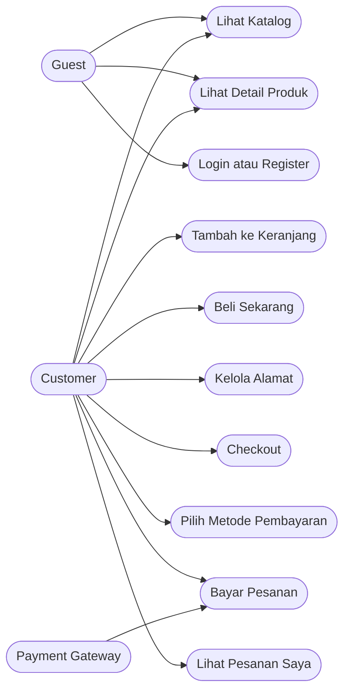
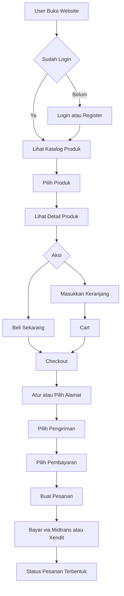
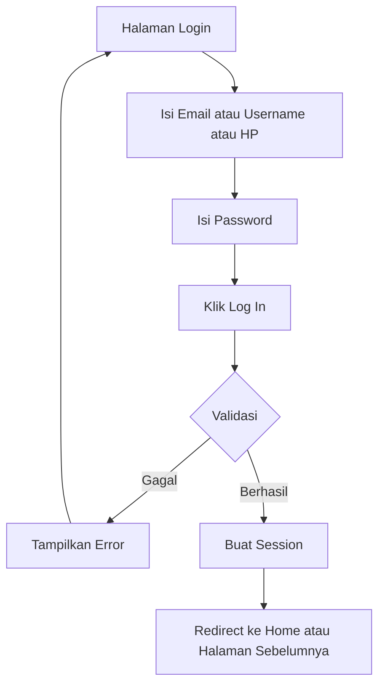
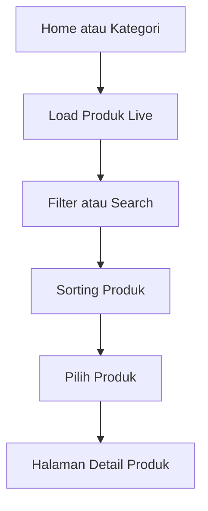
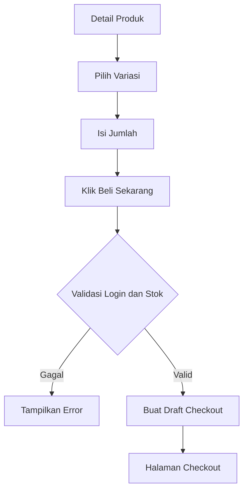
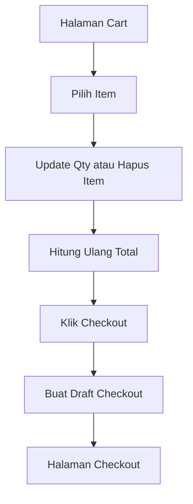
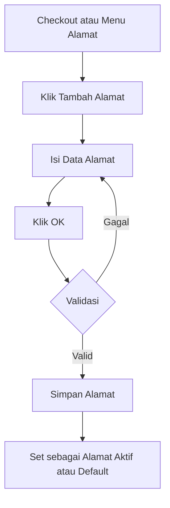
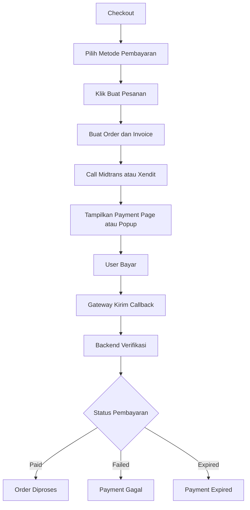
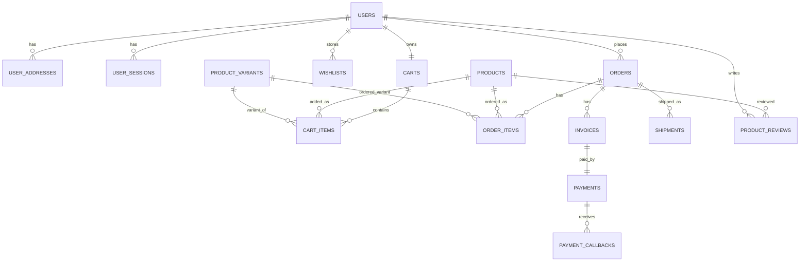

# Flow User Online Shop

## Tujuan
Dokumen ini menjelaskan flow sisi customer untuk online shop yang mengacu pada pola marketplace seperti Shopee, tetapi difokuskan pada kebutuhan toko sendiri. Flow utama customer yang dibahas:

1. `Login`
2. `Display Product / Katalog`
3. `Detail Product`
4. `Cart / Invoice / Checkout`
5. `Alamat Pengiriman`
6. `Pembayaran via Midtrans / Xendit`

Dokumen ini dipakai sebagai acuan untuk:
- flow bisnis sisi customer
- flow UI/UX frontend
- kebutuhan backend dan integrasi payment gateway
- struktur route frontend dan API

---

## A. STRUKTUR MENU CUSTOMER

## A.1 Menu Utama Customer
- Home
- Koleksi / Kategori Produk
- Search
- Detail Produk
- Cart / Keranjang
- Checkout
- Alamat Saya
- Pesanan Saya
- Login / Register
- Akun Saya

## A.2 Flow Besar Customer
1. User membuka website.
2. User login atau register.
3. User melihat katalog produk.
4. User memilih produk.
5. User melihat detail produk.
6. User memilih variasi dan jumlah.
7. User klik `Beli Sekarang` atau `Masukkan Keranjang`.
8. User masuk ke cart / checkout.
9. User memilih atau membuat alamat.
10. User memilih metode pembayaran.
11. Sistem membuat invoice.
12. User membayar lewat Midtrans atau Xendit.
13. Pesanan tercatat dan user bisa melihat status order.

---

## B. FLOW LOGIN CUSTOMER

## B.1 Tujuan
Memastikan customer dapat masuk ke sistem sebelum checkout, menyimpan alamat, dan melihat riwayat pesanan.

## B.2 Halaman Login
Mengacu pada pola login sederhana seperti marketplace:
- email / username / no handphone
- password
- login sosial opsional
- link lupa password
- link daftar akun baru

## B.3 Flow Login
1. User membuka halaman website.
2. User klik `Login`.
3. Sistem menampilkan form login.
4. User mengisi email / username / no handphone.
5. User mengisi password.
6. User klik `Log In`.
7. Sistem validasi kredensial.
8. Jika valid:
   - sistem membuat session / token login
   - user diarahkan ke halaman sebelumnya atau home
9. Jika tidak valid:
   - sistem menampilkan error
   - user tetap di halaman login

## B.4 Flow Register
1. User klik `Daftar`.
2. Sistem menampilkan form register.
3. User isi nama, email / nomor hp, password.
4. Sistem validasi data unik.
5. Sistem membuat akun baru.
6. User diarahkan ke halaman login atau langsung login otomatis.

## B.5 Flow Lupa Password
1. User klik `Lupa Password`.
2. User memasukkan email / nomor HP.
3. Sistem mengirim OTP atau link reset password.
4. User membuat password baru.
5. Sistem menyimpan password baru.

---

## C. FLOW DISPLAY PRODUCT / KATALOG

## C.1 Tujuan
Menampilkan katalog produk agar user bisa mencari, memfilter, dan menemukan produk yang ingin dibeli.

## C.2 Komponen Halaman Katalog
- Header
- Search bar
- Navigasi kategori
- Banner kategori
- Filter:
  - ukuran
  - warna
  - label
  - harga
- Sorting:
  - paling populer
  - terbaru
  - harga terendah
  - harga tertinggi
- Grid produk
- Badge produk:
  - populer
  - best seller
  - harga turun
  - kids

## C.3 Flow Katalog
1. User masuk ke halaman home atau kategori.
2. Sistem menampilkan daftar produk aktif.
3. User dapat:
   - browse kategori
   - pakai search
   - pakai filter
   - ubah sorting
4. Sistem memuat ulang produk sesuai filter.
5. User klik salah satu produk.
6. Sistem membuka halaman detail produk.

## C.4 Aturan Katalog
- Hanya produk `Live` yang tampil.
- Produk bisa tampil berdasarkan kategori, label, atau campaign.
- Sorting dan filter harus berbasis query parameter agar URL bisa dibagikan.

---

## D. FLOW DETAIL PRODUCT

## D.1 Tujuan
Menampilkan informasi lengkap produk dan mendorong user untuk membeli.

## D.2 Komponen Halaman Detail Produk
- Breadcrumb
- Gallery foto produk
- Nama produk
- Rating dan jumlah review
- Jumlah terjual
- Harga normal
- Harga promo
- Diskon
- Paket diskon jika ada
- Informasi pengiriman
- Jaminan toko
- Variasi:
  - warna
  - ukuran
  - opsi lain
- Quantity selector
- Tombol:
  - `Masukkan Keranjang`
  - `Beli Sekarang`
- Share
- Favorit

## D.3 Flow Detail Produk
1. User masuk ke halaman detail produk.
2. Sistem menampilkan detail produk lengkap.
3. User memilih variasi yang tersedia.
4. User menentukan kuantitas.
5. Sistem cek stok variasi.
6. User memilih aksi:
   - `Masukkan Keranjang`
   - `Beli Sekarang`

## D.4 Flow Masukkan Keranjang
1. User klik `Masukkan Keranjang`.
2. Sistem validasi:
   - user login
   - variasi sudah dipilih
   - stok cukup
3. Jika valid:
   - item masuk ke cart
   - sistem tampilkan notifikasi sukses
4. User bisa lanjut belanja atau buka keranjang.

## D.5 Flow Beli Sekarang
1. User klik `Beli Sekarang`.
2. Sistem validasi:
   - user login
   - variasi dipilih
   - stok cukup
3. Sistem membuat draft checkout dari item tersebut.
4. User diarahkan ke halaman cart / checkout.

## D.6 Validasi Detail Produk
- Variasi wajib dipilih jika produk punya variasi.
- Jumlah pembelian tidak boleh melebihi stok.
- Jumlah pembelian harus mengikuti min/max pembelian produk.

---

## E. FLOW CART / KERANJANG

## E.1 Tujuan
Menampilkan item yang akan dibeli sebelum user masuk ke checkout.

## E.2 Komponen Halaman Cart
- Daftar item per toko
- Checkbox pilih item
- Harga satuan
- Kuantitas
- Total harga
- Hapus item
- Produk serupa
- Voucher toko
- Voucher platform
- Total pembayaran
- Tombol `Checkout`

## E.3 Flow Keranjang
1. User membuka halaman `Cart`.
2. Sistem menampilkan item yang ada di cart.
3. User dapat:
   - ubah kuantitas
   - hapus item
   - pilih item tertentu
   - pakai voucher
4. Sistem menghitung ulang subtotal.
5. User klik `Checkout`.
6. Sistem membuat draft checkout dari item yang dipilih.

## E.4 Validasi Keranjang
- Hanya item aktif dan stok tersedia yang bisa dicheckout.
- Jika harga berubah sejak item masuk cart, sistem tampilkan harga terbaru.
- Jika stok berkurang, sistem minta user sesuaikan jumlah.

---

## F. FLOW CHECKOUT / INVOICE

## F.1 Tujuan
Menyatukan data pesanan, alamat, ongkir, voucher, dan pembayaran dalam satu halaman checkout.

## F.2 Komponen Halaman Checkout
- Alamat pengiriman
- Daftar produk yang dicheckout
- Ringkasan item dan variasi
- Catatan untuk penjual
- Pilihan pengiriman
- Voucher
- Ringkasan pembayaran:
  - subtotal
  - diskon
  - ongkir
  - biaya layanan jika ada
  - total akhir
- Pilihan metode pembayaran
- Tombol `Buat Pesanan`

## F.3 Flow Checkout
1. User masuk ke halaman checkout.
2. Sistem menampilkan:
   - item checkout
   - alamat default
   - pilihan kurir
   - metode pembayaran
3. User dapat ubah alamat atau tambah alamat baru.
4. User memilih kurir / layanan pengiriman.
5. Sistem menghitung ongkir.
6. User memilih metode pembayaran.
7. User klik `Buat Pesanan`.
8. Sistem membuat order, invoice, dan transaksi payment.
9. User diarahkan ke halaman pembayaran atau payment popup.

## F.4 Konsep Invoice
Dalam konteks ini, `invoice` adalah ringkasan pesanan yang dibuat setelah checkout:
- nomor invoice / nomor order
- daftar item
- total item
- diskon
- ongkir
- grand total
- status pembayaran
- expired time pembayaran

---

## G. FLOW ALAMAT CUSTOMER

## G.1 Tujuan
Memungkinkan user membuat dan memilih alamat pengiriman.

## G.2 Field Alamat
- Nama lengkap
- Nomor telepon
- Provinsi
- Kota / Kabupaten
- Kecamatan
- Kode pos
- Nama jalan / gedung / nomor rumah
- Detail tambahan / patokan
- Tag alamat:
  - rumah
  - kantor
  - lainnya
- Titik lokasi opsional

## G.3 Flow Tambah Alamat
1. User berada di checkout atau menu alamat.
2. User klik `Tambah Alamat`.
3. Sistem menampilkan modal / halaman alamat baru.
4. User isi seluruh field alamat.
5. User pilih label alamat.
6. User klik `OK`.
7. Sistem validasi field wajib.
8. Jika valid:
   - alamat disimpan
   - alamat bisa dijadikan default
   - user kembali ke checkout atau daftar alamat

## G.4 Flow Pilih Alamat
1. User membuka daftar alamat.
2. User memilih salah satu alamat.
3. Sistem menetapkan alamat aktif untuk checkout.
4. Sistem menghitung ulang opsi pengiriman berdasarkan alamat.

## G.5 Flow Edit / Hapus Alamat
1. User membuka daftar alamat.
2. User pilih `Edit` atau `Hapus`.
3. Sistem memproses perubahan.
4. Jika alamat sedang aktif di checkout, sistem reload estimasi pengiriman.

---

## H. FLOW PEMBAYARAN MIDTRANS / XENDIT

## H.1 Tujuan
Memproses pembayaran pesanan customer melalui payment gateway eksternal.

## H.2 Metode Pembayaran yang Bisa Didukung
Tergantung konfigurasi Midtrans / Xendit, minimal:
- Virtual Account
- E-Wallet
- QRIS
- Kartu Kredit / Debit
- Retail outlet
- Bank transfer

## H.3 Flow Pembayaran Umum
1. User klik `Buat Pesanan`.
2. Sistem membuat:
   - order
   - order items
   - invoice
   - payment transaction
3. Backend mengirim request create transaction ke Midtrans / Xendit.
4. Payment gateway mengembalikan:
   - payment token
   - payment url
   - va number / qr string / instruksi pembayaran
   - expired time
5. Sistem menampilkan halaman pembayaran ke user.
6. User menyelesaikan pembayaran.
7. Gateway mengirim callback / webhook ke backend.
8. Backend memverifikasi status transaksi.
9. Jika sukses:
   - status pembayaran menjadi `Paid`
   - status order menjadi `Diproses` atau `Menunggu Pengiriman`
10. Jika gagal / expired:
   - status pembayaran menjadi `Failed` atau `Expired`
   - user bisa bayar ulang

## H.4 Flow Jika Pakai Midtrans
1. Backend create transaksi ke Midtrans Snap / Core API.
2. Sistem menerima snap token atau redirect URL.
3. Frontend menampilkan popup Midtrans atau redirect.
4. Midtrans kirim notification ke backend.
5. Backend update payment status dan order status.

## H.5 Flow Jika Pakai Xendit
1. Backend create invoice / payment request ke Xendit.
2. Sistem menerima invoice URL atau payment channel data.
3. Frontend redirect user ke halaman pembayaran atau tampilkan instruksi.
4. Xendit kirim webhook ke backend.
5. Backend verifikasi signature dan update status transaksi.

## H.6 Aturan Pembayaran
- Setiap order punya satu invoice aktif utama.
- Invoice punya waktu kedaluwarsa.
- Callback gateway wajib diverifikasi signature / secret.
- Status pembayaran tidak boleh hanya bergantung pada frontend redirect.
- Backend adalah sumber kebenaran untuk status pembayaran final.

---

## I. FLOW PESANAN CUSTOMER

## I.1 Status Pesanan Customer
- `Belum Bayar`
- `Menunggu Pembayaran`
- `Diproses`
- `Perlu Dikirim`
- `Dikirim`
- `Selesai`
- `Dibatalkan`
- `Refund / Retur`

## I.2 Flow Setelah Pembayaran Sukses
1. Pembayaran dikonfirmasi gateway.
2. Sistem update order status.
3. User bisa melihat order pada menu `Pesanan Saya`.
4. Admin memproses order dari panel admin.
5. User menerima update status order sampai barang diterima.

## I.3 Menu Pesanan Saya
- Semua
- Belum Bayar
- Diproses
- Dikirim
- Selesai
- Dibatalkan

---

## J. USE CASE CUSTOMER

## J.1 Aktor
- `Guest`
- `Customer`
- `Payment Gateway`
- `Shipping Service`

## J.2 Daftar Use Case Utama
- Guest melihat katalog produk
- Guest melihat detail produk
- Customer login
- Customer register
- Customer menambah produk ke keranjang
- Customer beli sekarang
- Customer mengelola alamat
- Customer checkout
- Customer memilih pembayaran
- Customer membayar pesanan
- Customer melihat status pesanan

## J.3 Use Case Diagram



## J.4 Detail Use Case Penting

### UC-CUS-01 Login
- Aktor: `Customer`
- Tujuan: masuk ke akun customer
- Pre-condition: akun sudah terdaftar
- Main flow:
  1. Customer buka halaman login.
  2. Customer isi kredensial.
  3. Sistem validasi.
  4. Sistem membuat session login.

### UC-CUS-02 Lihat Produk
- Aktor: `Guest`, `Customer`
- Tujuan: melihat katalog dan mencari produk
- Main flow:
  1. User membuka halaman katalog.
  2. User filter atau search produk.
  3. Sistem menampilkan daftar produk.

### UC-CUS-03 Beli Produk
- Aktor: `Customer`
- Tujuan: membeli produk dari detail produk
- Main flow:
  1. Customer pilih variasi.
  2. Customer isi jumlah.
  3. Customer klik `Beli Sekarang`.
  4. Sistem buat draft checkout.
  5. Customer melanjutkan checkout.

### UC-CUS-04 Kelola Alamat
- Aktor: `Customer`
- Tujuan: menambah, edit, hapus, dan memilih alamat
- Main flow:
  1. Customer buka daftar alamat.
  2. Customer tambah atau edit alamat.
  3. Sistem simpan alamat.

### UC-CUS-05 Checkout dan Pembayaran
- Aktor: `Customer`, `Payment Gateway`
- Tujuan: menyelesaikan transaksi
- Main flow:
  1. Customer checkout.
  2. Customer memilih pembayaran.
  3. Sistem membuat invoice.
  4. Gateway memproses pembayaran.
  5. Sistem menerima callback dan update status.

---

## K. DIAGRAM WORKFLOW

## K.1 Workflow Besar Customer



## K.2 Workflow Login



## K.3 Workflow Katalog ke Detail Produk



## K.4 Workflow Beli Sekarang



## K.5 Workflow Cart ke Checkout



## K.6 Workflow Tambah Alamat



## K.7 Workflow Pembayaran



---

## L. ERD / RELASI TABEL AWAL CUSTOMER

## L.1 Entitas Utama
- `users`
- `user_addresses`
- `user_sessions`
- `carts`
- `cart_items`
- `wishlists`
- `orders`
- `order_items`
- `invoices`
- `payments`
- `payment_callbacks`
- `product_reviews`
- `shipments`

## L.2 Relasi Inti
- satu `user` punya banyak `user_addresses`
- satu `user` punya satu `cart`
- satu `cart` punya banyak `cart_items`
- satu `user` punya banyak `orders`
- satu `order` punya banyak `order_items`
- satu `order` punya satu atau banyak `invoices`
- satu `invoice` punya satu `payment`
- satu `payment` punya banyak `payment_callbacks`
- satu `order` bisa punya satu atau banyak `shipments`

## L.3 ERD Diagram



## L.4 Draft Kolom Utama

### `users`
- id
- name
- email
- phone
- password_hash
- is_active
- created_at
- updated_at

### `user_addresses`
- id
- user_id
- receiver_name
- phone
- province
- city
- district
- postal_code
- address_line
- address_detail
- label
- latitude
- longitude
- is_default
- created_at
- updated_at

### `carts`
- id
- user_id
- created_at
- updated_at

### `cart_items`
- id
- cart_id
- product_id
- product_variant_id
- quantity
- price_snapshot
- created_at
- updated_at

### `orders`
- id
- user_id
- order_number
- address_id
- subtotal
- discount_amount
- shipping_amount
- service_fee
- grand_total
- order_status
- payment_status
- fulfillment_status
- created_at
- updated_at

### `invoices`
- id
- order_id
- invoice_number
- amount
- expired_at
- status
- created_at
- updated_at

### `payments`
- id
- invoice_id
- provider
- provider_reference
- payment_method
- payment_channel
- amount
- status
- paid_at
- raw_response
- created_at
- updated_at

## L.5 Catatan Desain
- Simpan `price_snapshot` pada cart item dan order item untuk histori harga.
- Simpan `raw_response` payment gateway untuk audit dan debugging.
- Status order, invoice, dan payment harus dipisahkan agar flow lebih stabil.

---

## M. STRUKTUR MENU + ROUTE CUSTOMER

## M.1 Struktur Menu Customer

### Public
- Home
- Kategori
- Search
- Detail Produk
- Login
- Register

### Customer Authenticated
- Cart
- Checkout
- Pesanan Saya
- Alamat Saya
- Profile Saya
- Logout

## M.2 Route Frontend yang Disarankan

### Public
- `GET /`
- `GET /collections`
- `GET /collections/:slug`
- `GET /products/:slug`
- `GET /login`
- `GET /register`
- `GET /forgot-password`

### Customer
- `GET /cart`
- `GET /checkout`
- `GET /orders`
- `GET /orders/:id`
- `GET /addresses`
- `GET /profile`
- `GET /payment/:invoiceNumber`

## M.3 Route API yang Disarankan

### Auth
- `POST /api/auth/login`
- `POST /api/auth/register`
- `POST /api/auth/logout`
- `POST /api/auth/forgot-password`
- `POST /api/auth/reset-password`

### Product
- `GET /api/products`
- `GET /api/products/:slug`
- `GET /api/categories`

### Cart
- `GET /api/cart`
- `POST /api/cart/items`
- `PUT /api/cart/items/:id`
- `DELETE /api/cart/items/:id`

### Address
- `GET /api/addresses`
- `POST /api/addresses`
- `PUT /api/addresses/:id`
- `DELETE /api/addresses/:id`
- `PATCH /api/addresses/:id/default`

### Checkout and Order
- `POST /api/checkout`
- `POST /api/orders`
- `GET /api/orders`
- `GET /api/orders/:id`

### Payment
- `POST /api/payments/create`
- `GET /api/payments/:invoiceNumber`
- `POST /api/payments/midtrans/callback`
- `POST /api/payments/xendit/callback`

## M.4 Struktur Navigasi yang Direkomendasikan

```text
/
  /collections
    /:slug
  /products
    /:slug
  /login
  /register
  /forgot-password
  /cart
  /checkout
  /orders
    /:id
  /addresses
  /profile
  /payment
    /:invoiceNumber
```

---

## N. PRD RINGKAS PER MODUL CUSTOMER

## N.1 PRD Ringkas Modul Auth Customer

### Nama modul
`Customer Authentication`

### Tujuan bisnis
Memastikan customer bisa login, register, dan menyimpan data akun untuk pembelian berulang.

### Scope MVP
- login
- register
- lupa password
- session login

### KPI awal
- conversion login tinggi
- dropoff saat login rendah

## N.2 PRD Ringkas Modul Katalog dan Detail Produk

### Nama modul
`Product Discovery`

### Tujuan bisnis
Membantu customer menemukan dan memahami produk dengan cepat hingga masuk ke tahap pembelian.

### Scope MVP
- halaman home / kategori
- filter dan sorting
- detail produk
- variasi produk
- add to cart
- buy now

### KPI awal
- CTR dari katalog ke detail tinggi
- add to cart rate meningkat

## N.3 PRD Ringkas Modul Cart dan Checkout

### Nama modul
`Cart and Checkout`

### Tujuan bisnis
Mengubah niat beli menjadi order yang valid dengan friction serendah mungkin.

### Scope MVP
- keranjang
- voucher dasar
- checkout
- pilih alamat
- pilih pengiriman
- buat invoice

### KPI awal
- cart abandonment turun
- checkout success rate naik

## N.4 PRD Ringkas Modul Address Management

### Nama modul
`Address Book`

### Tujuan bisnis
Memudahkan customer menyimpan alamat dan mempercepat proses checkout.

### Scope MVP
- tambah alamat
- edit alamat
- hapus alamat
- default address

### KPI awal
- waktu checkout lebih cepat
- error alamat menurun

## N.5 PRD Ringkas Modul Payment Gateway

### Nama modul
`Payment Integration`

### Tujuan bisnis
Memberi customer metode pembayaran yang mudah dan memastikan status transaksi akurat.

### Scope MVP
- integrasi Midtrans
- integrasi Xendit
- create payment transaction
- callback handling
- payment status page

### KPI awal
- payment success rate tinggi
- mismatch status payment rendah

## N.6 Non-Goal Tahap Awal
- live chat customer service
- loyalty point kompleks
- multi seller marketplace
- split payment
- affiliate customer

## N.7 Prioritas Build yang Disarankan
1. Auth customer
2. Katalog produk
3. Detail produk
4. Cart
5. Checkout + alamat
6. Payment Midtrans / Xendit
7. Pesanan saya

## N.8 Definisi Selesai Tahap MVP
- User bisa login dan register
- User bisa lihat katalog dan detail produk
- User bisa tambah ke keranjang dan beli sekarang
- User bisa menambah alamat
- User bisa checkout
- User bisa bayar lewat Midtrans atau Xendit
- User bisa melihat status pesanan
